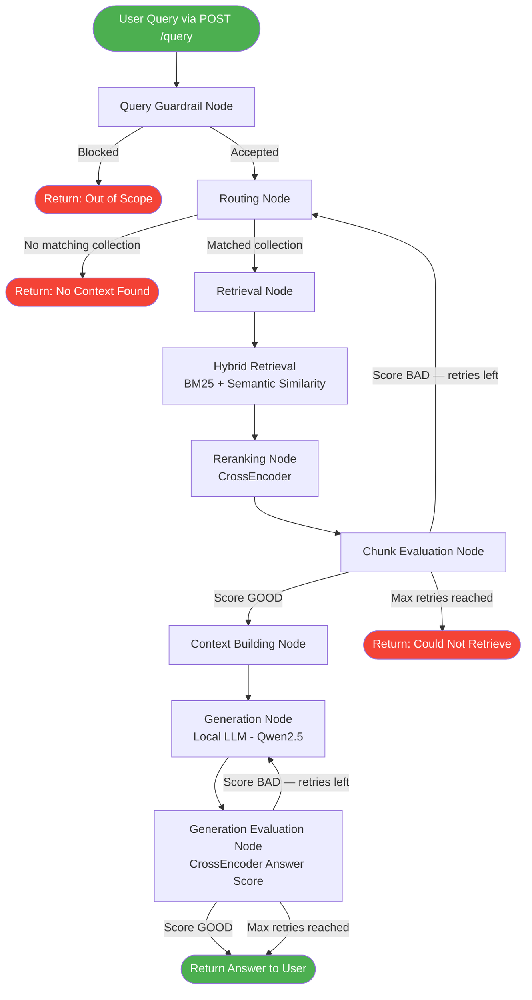
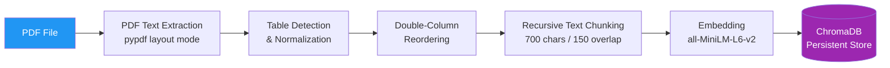

<div align="center">

# Enterprise RAG Chatbot

**A production-ready Retrieval-Augmented Generation API built with FastAPI, LangGraph, ChromaDB, and a local LLM — delivering accurate, grounded answers from your private document collections.**

[](https://www.python.org/)
[](https://fastapi.tiangolo.com/)
[](https://langchain-ai.github.io/langgraph/)
[](https://www.trychroma.com/)
[](LICENSE)

</div>

---

## Table of Contents

- [Overview](#overview)
- [Architecture & Pipeline Flow](#architecture--pipeline-flow)
- [Key Features](#key-features)
- [Tech Stack](#tech-stack)
- [Project Structure](#project-structure)
- [Getting Started](#getting-started)
- [API Reference](#api-reference)
- [Configuration](#configuration)
- [Benefits](#benefits)
- [Roadmap](#roadmap)

---

## Overview

Enterprise RAG Chatbot is a domain-specific Q&A service that answers questions **strictly from your own PDF documents** — no hallucination, no out-of-scope answers. It combines hybrid search (keyword + semantic), neural reranking, and a locally-hosted LLM into a single FastAPI service, orchestrated by a stateful LangGraph pipeline with built-in evaluation and retry loops.

> Designed for teams who need a private, auditable, self-hosted alternative to cloud AI assistants.

---

## Architecture & Pipeline Flow

### Query Pipeline



### Document Ingestion Pipeline



---

## Key Features

| Feature | Description |
|---|---|
| **Hybrid Retrieval** | Combines BM25 (keyword) and semantic cosine similarity — weighted fusion for better recall |
| **Neural Reranking** | CrossEncoder (`ms-marco-MiniLM-L-6-v2`) scores each candidate pair for maximum precision |
| **Multi-Collection Routing** | Automatically routes each query to the most relevant document collection |
| **Evaluation & Retry Loop** | Chunk quality and answer quality scored independently; bad results trigger automatic retries |
| **Query Guardrail** | Blocks out-of-scope, roleplay, and opinion requests before they reach the LLM |
| **Smart Table Parsing** | Detects and normalizes multi-column PDF tables into clean LLM-readable text |
| **Concurrent-Safe Ingestion** | `asyncio.Lock` ensures no race conditions during simultaneous PDF uploads |
| **Path Traversal Protection** | All uploaded filenames sanitized with `os.path.basename` |
| **Lifespan Model Loading** | Models loaded once at startup — zero cold-start penalty on requests |
| **Singleton ChromaDB Client** | One persistent client reused across all operations — no repeated connection overhead |

---

## Tech Stack

### Core Framework

| Tool | Role |
|---|---|
| **FastAPI** | Async REST API framework with auto-generated OpenAPI docs |
| **LangGraph** | Stateful multi-node pipeline with conditional edges and retry loops |
| **Uvicorn** | High-performance ASGI server |

### AI / ML

| Tool | Role |
|---|---|
| **Qwen2.5-0.5B-Instruct** | Local LLM for grounded answer generation (HuggingFace Transformers) |
| **all-MiniLM-L6-v2** | Fast sentence embedding model (SentenceTransformers) |
| **ms-marco-MiniLM-L-6-v2** | CrossEncoder reranker for candidate scoring |
| **BM25Okapi** | Classical keyword retrieval (rank_bm25) |

### Storage & Search

| Tool | Role |
|---|---|
| **ChromaDB** | Local persistent vector store with cosine similarity indexing |
| **HNSW Index** | Approximate nearest-neighbour search inside ChromaDB |

### Document Processing

| Tool | Role |
|---|---|
| **pypdf** | PDF text extraction with layout-aware mode |
| **langchain-text-splitters** | Recursive character splitter with configurable chunk size and overlap |

### Infrastructure

| Tool | Role |
|---|---|
| **PyTorch** | Model inference backend — auto-detects CPU or CUDA GPU | 
| **contextlib lifespan** | FastAPI startup/shutdown lifecycle management |

---

## Project Structure

```
enterprise-rag/
├── src/
│   └── app.py                       # FastAPI app + full LangGraph RAG pipeline
├── data/
│   └── documents/
│       ├── ArtificalIntelligence/   # Domain PDF collections
│       ├── CICD/
│       ├── Transformer/
│       └── uploads/                 # Runtime PDF uploads land here
├── Docs/
│   └── chromadb_dynamic_1/          # ChromaDB persistence (gitignored)
├── docs/
│   └── README.md
├── requirements.txt
└── README.md
```

---

## Getting Started

### Prerequisites

- Python 3.10+

### Installation

```bash
# 1. Clone the repository
git clone https://github.com/AfnanAnsari748/enterprise-rag.git
cd enterprise-rag

# 2. Create and activate virtual environment
python -m venv venv
source venv/bin/activate        # Linux / Mac
venv\Scripts\activate           # Windows

# 3. Install dependencies
pip install -r requirements.txt
```

### Run the API

```bash
python -m uvicorn src.app:app --host 0.0.0.0 --port 8000
```

Interactive API docs available at: `http://localhost:8000/docs`

### First-Time Setup

```bash
# 1. Place your PDFs in data/documents/<collection-name>/

# 2. Build embeddings (run once — re-run when docs change)
curl -X POST http://localhost:8000/create_embeddings

# 3. Ask a question
curl -X POST http://localhost:8000/query \
     -H "Content-Type: application/json" \
     -d '{"query": "What is the attention mechanism in transformers?"}'
```

---

## API Reference

### `GET /health`
Health check — confirms the service is running.

**Response:**
```json
{ "status": "ok" }
```

---

### `POST /create_embeddings`
Processes all PDFs across all configured collections and stores embeddings in ChromaDB.

**Response:**
```json
{
  "status": "success",
  "message": "Embeddings created successfully"
}
```

---

### `POST /ingest`
Upload a new PDF and ingest it as a new collection dynamically.

**Request:** `multipart/form-data` with `file` field (PDF only)

**Response:**
```json
{
  "status": "success",
  "message": "File uploaded and ingested successfully",
  "filename": "my_document.pdf"
}
```

---

### `POST /query`
Run a query through the full RAG pipeline.

**Request:**
```json
{ "query": "What is a CI/CD pipeline?" }
```

**Response:**
```json
{
  "answer": "A CI/CD pipeline automates the process of building, testing...",
  "domain": "CICD",
  "retrieval_seconds": 0.42,
  "generation_seconds": 3.17,
  "chunks": [
    {
      "text": "...",
      "metadata": { "filename": "cicd_guide.pdf", "chunk": 4 },
      "hybrid_score": 0.87,
      "rerank_score": 0.91
    }
  ],
  "blocked": false
}
```

---

## Configuration

All tunable constants are at the top of `src/app.py`:

| Constant | Default | Description |
|---|---|---|
| `MODEL_ID` | `Qwen/Qwen2.5-0.5B-Instruct` | HuggingFace model ID for generation |
| `RERANKER_MODEL` | `cross-encoder/ms-marco-MiniLM-L-6-v2` | CrossEncoder reranker model |
| `EMBED_MODEL_NAME` | `all-MiniLM-L6-v2` | Sentence embedding model |
| `PERSIST_DIRECTORY` | `Docs/chromadb_dynamic_1` | ChromaDB persistence path |
| `COLLECTIONS_CONFIG` | See `app.py` | List of `(folder_path, collection_name)` tuples |

### Adding a New Document Collection

```python
# In src/app.py — append to COLLECTIONS_CONFIG:
COLLECTIONS_CONFIG = [
    ("data/documents/ArtificalIntelligence", "ArtificalIntelligence"),
    ("data/documents/CICD", "CICD"),
    ("data/documents/Transformer", "Transformer"),
    ("data/documents/YourDomain", "YourDomain"),    # ← add here
]
```

Then re-run `POST /create_embeddings` to index the new collection.

---

## Benefits

### For Developers
- **Modular LangGraph nodes** — add, remove, or swap pipeline stages without touching the rest
- **Fully offline** — no external AI API keys or cloud dependencies required
- **Auto-routing** — no need to specify which collection to query; the system decides

### For Enterprises
- **Data Privacy** — all documents and queries stay on your own infrastructure; nothing leaves your network
- **Grounded Answers** — the LLM answers strictly from the provided context; refuses out-of-scope questions
- **Auditable** — every pipeline node logs its decision; retrieved chunks are returned alongside every answer
- **Multi-Domain** — one service handles multiple document collections with intelligent automatic routing
- **Secure Ingestion** — path traversal protection and strict file-type validation on all uploads
- **Concurrent-Safe** — `asyncio.Lock` prevents data corruption under simultaneous ingestion requests

### For End Users
- **Fast** — hybrid retrieval and reranking complete in under 1 second on CPU
- **Accurate** — neural reranking eliminates irrelevant chunks before generation
- **Honest** — explicitly says "I don't know" when the answer is not in the documents

---

## Roadmap

- [ ] JWT / API-key authentication middleware
- [ ] Streaming responses via Server-Sent Events
- [ ] Async background ingestion with job-status polling endpoint
- [ ] Multi-turn conversation memory with session history (Redis)
- [ ] Semantic answer caching to reduce repeated LLM calls
- [ ] Prometheus metrics + Grafana observability dashboard
- [ ] Docker + Kubernetes deployment manifests
- [ ] Support for DOCX, PPTX, and HTML documents
- [ ] Query rewriting with HyDE (Hypothetical Document Embeddings)
- [ ] PII detection and redaction (Microsoft Presidio)

---

## License

This project is licensed under the [MIT License](LICENSE).

---

## Contact

**Afnan Ansari**
GitHub: [@AfnanAnsari748](https://github.com/AfnanAnsari748)
